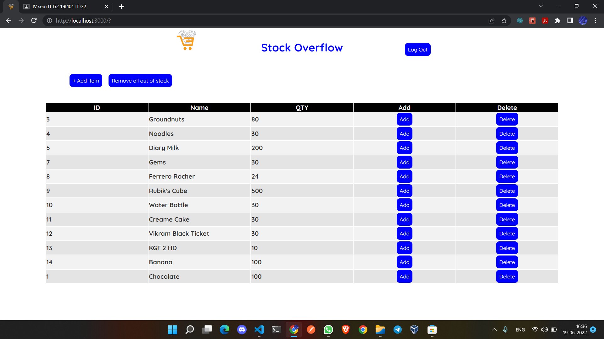
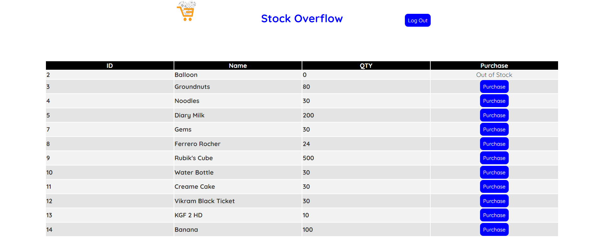

# Stock Overflow

Stock Overflow is a warehouse stock manager developed using React, MongoDB and Express.js. It provides Admin as well as Client side dashboard for managing the stocks.

## Getting started

```powershell
git clone http://
cd StockOverflow
```

After this, open three terminals in the folder

```powershell
cd backend/db
mongod --dbpath=data --bind_ip 127.0.0.1
```

```powershell
cd backend
npm install
node Server.js
```

```powershell
cd frontend
npm install
npm start
```

## Login Page (for Admin)

password for admin is "root"
</img>
<br>

## Dashboard (for Admin)

`+ Add Item` button is used to add a new stock (with id, name, quantity) to database

`Add` button is used to add more quantity to existing stock

`Delete` button is used to remove a stock from database
<br>
</img>
<br>

## Login Page (for Client)

password is not used for Client authentication
</img>
<br>

## Dashboard (for Client)

`Purchase` button is used to purchase a stock (which decreaments the quantity in database)
</img>


## Collaborators

<table>
<tr>
<td><a href="github.com/AkashSCIENTIST"></img><br>Akash S P</a></td>
<td><a href="github.com/sunshine-haze321">
</img><br>Archana E</a></td>
<td><a href="github.com/Harshan-R">
</img><br>Harshan R</a></td>
<td><a href="github.com/LOGESHWARAN-C">
</img><br>Logeshwaran C</a></td>
<td><a href="github.com/KcT71">
</img><br>Tharun K C</a></td>
</tr>
</table>
